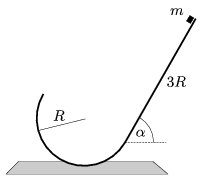

P. 4308. A vízszintessel =60$^\circ$-os szöget bezáró, 3 R hosszúságú sima lejtő alsó, vízszintes élével törésmentesen csatlakozik egy R =0,5 m sugarú, félkörív keresztmetszetű hengerfelülethez. A lejtő tetejéről kezdősebesség nélkül lecsúszik egy pontszerűnek tekinthető, m =0,2 kg tömegű test.

 a ) Mekkora lesz a test mozgási energiája a lejtő alját követő pályájának legmagasabb pontján?
 b ) Hol csapódik a test a lejtőre?
 (A súrlódás és a közegellenállás elhanyagolható.)

