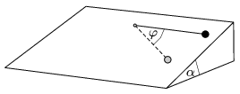

P. 4324. Egy =1 m hosszú fonál egyik végét =30$^\circ$ hajlásszögű lejtő lapjához rögzítjük. A fonál másik végéhez egy m =1 kg tömegű, pontszerű testet rögzítünk az ábrán látható módon. A testet a fonál kiegyenesített, vízszintes helyzetében kezdősebesség nélkül elengedjük. A lejtő és a test közötti súrlódási együttható =0,2.

 a ) Határozzuk meg a lejtőn lecsúszó test maximális sebességét!
 b ) Mekkora a fonálban ébredő erő abban a helyzetben, amikor a fonál (először) =60$^\circ$-os szöget zár be a kezdeti állapotával?
 c ) A fonál melyik helyzetében maximális a fonálerő?

