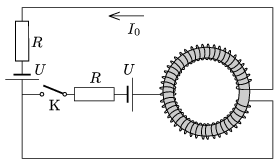

P. 4325. Egy három kivezetésű, vasmaggal ellátott toroid tekercset az ábrán látható módon áramkörbe kötünk. Mekkora áram fog folyni a K kapcsolón keresztül közvetlenül annak zárása után, ha kezdetben I $_{0}$ erősségű áram folyt az áramkörben? (A tekercs ohmikus ellenállása R -hez képest elhanyagolható.)

