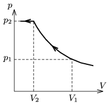

P. 4334. Egy dugattyúval ellátott tartályban T =77,4 K hőmérsékletű nitrogén- és oxigéngáz keveréke található. A hőmérsékletet állandó értéken tartva a gázelegyet lassan összenyomjuk. A keverék nyomása az ábrán látható módon változik a térfogat függvényében, ahol V $_{1}$=15 dm$^{3}$ és p $_{1}$=56,3 kPa.

 a ) Mennyi nitrogén és mennyi oxigén van a tartályban?
 b ) Határozzuk meg az izotermán található egyetlen töréspont koordinátáit! (Lásd a 2010. évi Eötvös-verseny 2. feladatának megoldását a 171. oldalon!)

