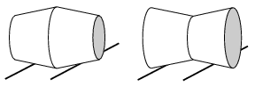

P. 4339. Egyforma gumidugókat az ábrán látható módon összeragasztottunk. A testeket a vízszinteshez képest enyhén döntött, az eredeti dugók magasságával megegyező nyomtávú sínpárra helyezzük, és hagyjuk, hogy legördüljenek. Meglepve tapasztaljuk, hogy az egyik test minden próbálkozás során eléri a lejtő alját, a másik viszont a sokadik kísérlet után is ,,kisiklik''. Melyik? (A testek mindvégig tisztán gördülnek.)

