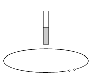

P. 4354. Vízszintes síkú, rögzített, nyitott vezető karika középpontja felett egy 12 cm hosszú, függőleges tengelyű rúdmágnest tartunk úgy, hogy alsó vége 4 cm-re van a karika középpontjától. A mágnest elejtjük, és azt tapasztaljuk, hogy amikor az alsó vége éppen a karika síkjához ér, a karika végei között +2 V feszültség indukálódik. Mekkora és milyen polaritású feszültség indukálódik a karikában abban a pillanatban, amikor a mágnes közepe, illetve a felső vége éppen áthalad a karika középpontján?

