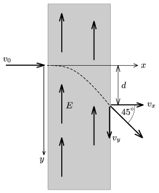

P. 4357. Egy elektron a fénysebesség 60%-ával mozogva a sebességére merőleges irányú, homogén elektromos mezőbe érkezik. Amikor elhagyja az elektromos mezőt, sebességének iránya a kezdősebesség irányával 45$^\circ$-os szöget zár be.

 a ) Mekkora sebességgel mozog az elektromos mezőt elhagyó elektron?
 b ) Mekkora az ábrán jelölt d távolság, ha a térerősség nagysága E =510 kV/m? (Az elektron nyugalmi energiája m $_{0}$ c $^{2}$=510 keV.)

