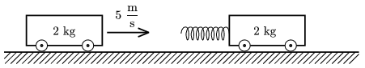

P. 4372. Vízszintes asztalon két, egyenként 2 kg tömegű kiskocsi nyugszik egy vonalban. Az egyiken egy rugó is van az ábra szerint. A bal oldali kiskocsit sebességgel meglökjük, amely ezután a jobb oldali kiskocsinak ütközik.

 Mennyi energia van a rugóban, amikor az az ütközés során a legrövidebb?

