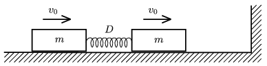

P. 4373. Vízszintes, súrlódásmentes felületen lévő, m =0,5 kg tömegű testeket D =16 N/m direkciós erejű, L =20 cm hosszúságú, elhanyagolható tömegű, nyújtatlan rugó köt össze. A testeket egy adott pillanatban v $_{0}$=0,36 m/s sebességgel elindítjuk a jobbra levő függőleges fal irányába. A jobb oldali test rugalmasan ütközik a fallal.

 a ) Mekkora a mozgás során a rugó maximális összenyomódása?
 b ) A fallal való ütközés után mennyi idő múlva lesznek egymáshoz legközelebb a testek?
 c ) Lesz-e további ütközés a fallal? Hogyan mozog a rendszer, ha elegendő ideig várunk?
 d ) Mekkora a rendszer lendületváltozása, miután valamennyi ütközés lezajlott?

