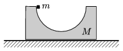

P. 4394. Vízszintes felületen lévő, rögzített hasábból egy félhenger alakú rész hiányzik. A hengeres rész legfelső pontjából egy m  tömegű, kisméretű testet engedünk el. (A súrlódás elhanyagolható.)

 a ) Mekkora erővel nyomja a kis test a hasábot a pálya legmélyebb pontján?
 b ) Ha a hasáb súrlódásmentesen csúszhat a vízszintes felületen, akkor a kis test erővel nyomja a hasábot a pálya legmélyebb pontján. Hányszor nagyobb tömegű a hasáb, mint a kis test?

