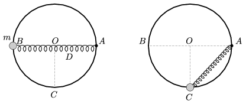

P. 4405. Egy függőleges síkú, r =30 cm sugarú, O középpontú, rögzített körgyűrűre egy m =0,4 kg tömegű testet fűztünk fel, amely a pályán súrlódásmentesen mozoghat. A testhez egy olyan rugót erősítettünk, amelynek rugóállandója D =16 N/m, és a hossza nyújtatlan állapotban 30 cm. A rugó másik végét a pálya vízszintes átmérőjének A  pontjához rögzítettük. Mekkora sebességgel halad át a  B  pontból nulla kezdősebességgel elengedett test a pálya legmélyebb ( C ) pontján?
 Mekkora erővel terheli ekkor a test a gyűrűt, és milyen irányú a gyorsulása a  C pontban?

