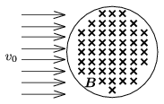

P. 4419. Homogén, B indukciójú, R sugarú, kör keresztmetszetű mágneses mezőbe azonos v $_{0}$ sebességű elektronok nyalábja érkezik az indukcióvonalakra merőlegesen, az ábrán látható módon. A mágneses mezőn való áthaladás után legfeljebb mekkora szögben hajlanak el az eredeti mozgásirányuktól a nyaláb elektronjai? (Feltételezhetjük, hogy a mágneses mező elég gyenge.)

