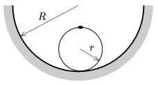

P. 4425. Egy r sugarú abroncs kerületére vele megegyező tömegű, kicsiny nehezék van erősítve. Az abroncsot R  sugarú, félhenger alakú, rögzített, érdes vályúba helyezzük úgy, hogy a nehezék legfelül legyen. Legalább mekkora r / R  arány mellett lesz az abroncs egyensúlyi állapota stabil?

