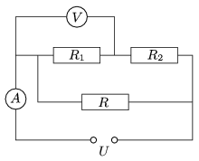

P. 4447. Mekkora az ábrán szereplő R $_{1}$ és R $_{2}$ ellenállások értéke, ha az áramforrás feszültsége 40 V, az R ellenállás teljesítménye 80 W, az árammérő 3 A-t és a feszültségmérő 30 V-ot jelez?

