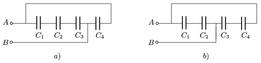

P. 4461. Milyen összefüggés áll fenn a C $_{1}$, C $_{2}$, C $_{3}$, C $_{4}$ kapacitások között, ha az a ) és b ) esetben ugyanakkora az A és B  pontok közötti eredő kapacitás?

 Schwartz emlékverseny, Nagyvárad (Románia)

