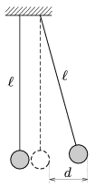

P. 4485. Két, közvetlenül egymás mellé felfüggesztett egyforma golyó az ábra síkjában lenghet  hosszúságú fonálon. Az egyik golyót d  távolságra kimozdítjuk és elengedjük ( d ). A golyók rugalmatlanul ütköznek, sebességük a tömegközépponti rendszerben minden ütközéskor k -szorosára csökken (0< k <1 az ütközési szám).

 Hogyan mozognak a golyók? Mekkora lesz a lengések amplitúdója sok ütközés után?

