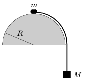

P. 4490. Egy rögzített félgömb tetejére helyezett m  tömegű kis test fonállal össze van kötve a függőlegesen lógó M  tömegű testtel. Elengedjük a rendszert, a  m  tömegű test súrlódás nélkül csúszik le a félgömbről. Mekkora m / M tömegarány esetén fog elválni a  m  tömegű test pontosan 45$^\circ$-os szöghelyzetben a félgömbtől? Hol válik el a kis test, ha M m , és hol válik el, ha M m ?

