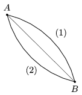

P. 4500. Egy kis gyöngy az ábrán látható két pályán csúszhat le az A  pontból a  B  pontba. A pályák függőleges síkban fekvő körívek, melyek szimmetrikusak az  A és B  pontokon átmenő, a vízszintessel 45$^\circ$-os szöget bezáró egyenesre.

 a ) Melyik pályán ér le hamarabb a gyöngy, és mit mondhatunk a végsebességekről, ha nincs súrlódás?
 b ) Mit állíthatunk a végsebességekről akkor, ha a súrlódás nem hanyagolható el, és a súrlódási együttható mindkét pályán ugyanakkora?

