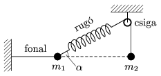

P. 4520. Az ábra szerinti elrendezésben a testek nyugalomban vannak; m $_{1}$=1 kg, =30$^\circ$. Az  m $_{1}$ tömegű testet a falhoz rögzítő fonal vízszintes.

 a ) Határozzuk meg m $_{2}$ nagyságát!
 b ) Tegyük fel, hogy elszakad az  m $_{1}$ tömegű testet a falhoz rögzítő fonal! Mekkora gyorsulással kezdenek mozogni ekkor a testek?
 Szegedi Ervin (1956-2006) feladata

