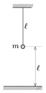

P. 4547. Vízszintes, földelt fémpadló felett magasságban leng az hosszúságú fonálinga. Lengésideje T $_{1}$=2,00 s. Mekkora töltést vittünk fel az inga m =25 gramm tömegű nehezékére, ha a lengésideje T $_{2}$=1,96 s-ra csökkent?

