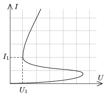
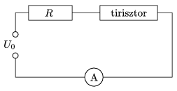

P. 4549. A tirisztor egy félvezetőből készült, sokoldalúan használható áramköri elem, amelynek különös áram-feszültség karakterisztikája van (lásd az 1. ábrát ).

 1. ábra
 A tirisztort a 2. ábrán látható kapcsolásba kötjük, és az U $_{0}$ feszültséget zérusról lassan U $_{max }$-ig növeljük, majd - szintén lassan - lecsökkentjük 0-ra. Ábrázoljuk az áramerősséget az U $_{0}$ feszültség függvényében, ha

 2. ábra
 a ) és ,
 b ) és .

