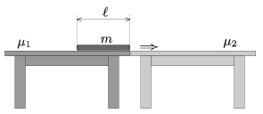

P. 4554. Két asztal áll szorosan egymás mellett. Mennyi munkát végez az a személy, aki az egyik asztalon levő lapos csomagot a másikra áthúzza? A csomag és az asztallapok közötti súrlódási együtthatók különbözőek.

 Adatok: m =18 kg; =0,8 m; $_{1}$=0,1; $_{2}$=0,4. (A csomag súlya egyenletesen oszlik el az asztalokkal érintkező felületek mentén.)
 Jedlik Ányos fizikaverseny, Nyíregyháza

