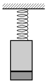

P. 4557. Az ábrán látható rugó végére egy 0,6 kg tömegű vashenger van kötve, a vashenger aljára pedig egy 0,2 kg tömegű, korong alakú mágnes tapad. A 64 N/m direkciós erejű rugó kezdetben nyújtatlan, majd ebből a helyzetből a rendszert magára hagyjuk. A rezgés során a mágnes nem esik le a vashengerről.

 a ) Mekkora a rezgés periódusideje?
 b ) Mekkora a mágnes legnagyobb sebessége?
 c ) Legalább mekkora a mágnes és a vashenger közötti vonzóerő?
 Wigner Jenő fizikaverseny, Békéscsaba

