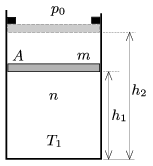

P. 4581. Függőleges, A =2 dm$^{2}$ keresztmetszetű, alul zárt hengerben súrlódásmentesen mozgó, m  tömegű dugattyú n =0,25 mol mennyiségű, T $_{1}$=300 K hőmérsékletű, kétatomos gázt zár el. A dugattyú ekkor h $_{1}$=3 dm távolságra helyezkedik el a henger aljától, a külső légnyomás p $_{0}$=10$^{5}$ Pa.

 A bezárt gázt két szakaszban melegíteni kezdjük. Az első szakasz addig tart, amíg a dugattyú el nem éri az ütközőket, ekkor a dugattyú h $_{2}$=5 dm távolságra van a henger aljától. Az ütközők elérésekor kezdődő második szakaszban a közölt hő -szerese az első szakaszban közölt hőnek.
 a ) Határozzuk meg a dugattyú m tömegét!
 b ) Mekkora erőt fejtenek ki az ütközők együttesen a dugattyúra a két melegítési szakasz befejezése után?
 c ) Ábrázoljuk a gáz nyomását az abszolút hőmérséklet függvényében!

