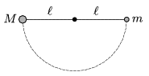

P. 4585. Egy M és egy m tömegű kis golyót közös pontban felfüggesztett, hosszúságú fonalakhoz rögzítünk. Vízszintesig kitérítjük, majd egyszerre elengedjük a golyókat, amelyek ezután centrálisan, tökéletesen rugalmasan ütköznek.

 a ) Milyen M / m tömegarány esetén jut el a m tömegű golyó a fonál által lehetővé tett legnagyobb magasságig az első ütközés után?
 b ) Milyen magasra jut el ebben az esetben a  M  tömegű test?

