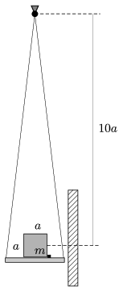

P. 4588. Az a oldalélű, m tömegű, homogén tömegeloszlású kockát egy érdes felületű, sík tartóra helyezzük, és az egyik oldaléle mentén egy kicsiny ütközőhöz illesztjük. A tartót fonalakkal felfüggesztjük a kocka tömegközéppontja felett  magasságban (lásd az  ábrát ), majd a rendszert ingaként bizonyos szöggel óvatosan kitérítjük, és ott elengedjük.

 Amikor az inga legmélyebb helyzetébe visszaérkezik, a sík tartó egy nagy tömegű falba ütközik. Mekkora volt a kitérítés szöge, ha a kocka átborul az ütközőn? Az ütközések tökéletesen rugalmatlanok.
 (A tartó és a fonalak tömege a kocka tömege mellett elhanyagolható. A kocka tehetetlenségi nyomatéka a középpontján átmenő bármely tengelyre ma $^{2}$/6.)

