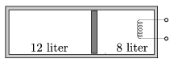

P. 4590. Hőszigetelő hengerben ugyancsak hőszigetelő, könnyen mozgó dugattyú választ el 12 l és 8 l térfogatú, normál állapotú levegőt. A 8 l térfogatú részbe fűtőszálat építettünk, amellyel a gáz hőmérsékletét 200 $^\circ$C-ra emeljük, majd a fűtést kikapcsoljuk.

 a ) Mekkora a két gáz térfogata és nyomása a folyamat végén?
 b ) Mekkora az eredetileg 12 l térfogatú levegő hőmérséklete a folyamat végén?
 c ) Mennyi hőt vesz fel a melegített gáz a folyamat végéig?
 d ) Mennyivel változik a két gáz belső energiája külön-külön?

