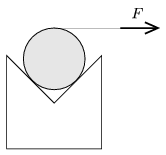

P. 4597. Egy ék alakú, vízszintes, derékszögű vályúban egy henger nyugszik az ábra szerint. A hengert vízszintes irányban óvatosan, egyre nagyobb erővel húzzuk egy rátekert fonál segítségével. Mi történik, ha a súrlódási együttható
 a ) =0,5;
 b ) =0,3?

