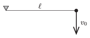

P. 4642. Egy $\ell=20$ cm hosszú fonálingát a vízszintesig kitérítünk, majd függőlegesen lefelé $v_0= 2$ m/s sebességgel elindítjuk. Mekkora szöget zár be a függőlegessel a fonál, amikor meglazulása után újra megfeszül?

