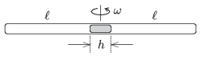

P. 4643. Egy vízszintes, vékony cső mindkét vége zárt. A cső közepén egy $h$  hosszúságú higanyszál van. A levegőoszlopok hossza mindkét térrészben $\ell$, a nyomás mindkét oldalon $H$ magasságú higanyoszlop hidrosztatikai nyomásával egyenlő. A csövet egy függőleges tengelyű centrifugagépre helyezzük, és $\omega$ szögsebességgel megforgatjuk.

 Mekkora periódusidejű (kis) rezgéseket végezhet a higanyszál, ha a hőmérséklet állandó? Feltételezhetjük, hogy $\ell$-hez képest $h$ viszonylag kicsi, emiatt a higanyszál nem szakad el. (Lásd még a  P. 4609. feladat megoldását lapunk 309. oldalán!)
 Varga István (1952-2007) feladata

