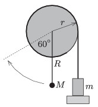

P. 4655. Középen tengelyezett, $r=0{,}1~$m sugarú, igen könnyű korong peremére fonalat tekertünk, annak szabad végére egy $m=100~$g tömegű testet erősítettünk. A koronghoz elhanyagolható tömegű rúd csatlakozik, amelynek végére, a korong tengelyétől $R=0{,}2~$m távolságban egy kisméretű, $M$  tömegű testet rögzítettünk.
 Kezdetben a rendszer az  ábrán látható helyzetben nyugalomban van. A $m$  tömeg alátámasztását hirtelen elvéve a $M$  tömegű test az ábrán szaggatott vonallal jelölt $60^\circ$-os helyzetet éppen eléri. Kis csillapítású lengések után a rúd egyensúlyba kerül, ekkor $\varphi$ szöget zár be a függőlegessel.

 $a)$ Mekkora a rúdon levő test $M$ tömege?
 $b)$ Mekkora a $\varphi$ szög?
 $c)$ Az egyensúlyi helyzetből kicsit kimozdítva a rendszert, mekkora rezgésidejű mozgás jön létre?
 Izsák Imre Gyula természettudományi fizikaverseny, Zalaegerszeg

