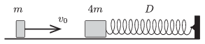

P. 4707. Vízszintes felületen egy $m=0{,}2~$kg és egy $4m$ tömegű test súrlódásmentesen mozoghat. A nagyobb tömegű test egy $D=320~$N/m rugóállandójú, nyújtatlan húzó-nyomó rugóhoz van erősítve. A kisebb tömegű test $v_0=5$ m/s sebességgel egyenesen nekiütközik a nyugalomban lévő másik testnek. Az ütközés teljesen rugalmas.

 $a)$ Mekkora a rugó maximális összenyomódása?
 $b)$ Mennyi lesz a rugóhoz erősített test legnagyobb sebessége és a rugó legnagyobb megnyúlása?

