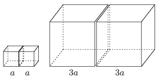

P. 4718. Két $a$ oldalélű tömör fémkocka érintkezik egymással az egyik lapjuk mentén. Hányszor nagyobb gravitációs erővel vonzza egymást két $3a$  oldalélű, egymással érintkező, ugyanabból a fémből készült tömör fémkocka?

