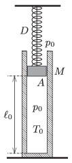

P. 4729. Függőlegesen álló, $A=5~{\rm dm}^2$ belső keresztmetszetű hőszigetelt hengerben egy fonálra függesztett, $M=80~$kg tömegű, könnyen mozgó dugattyú zár el $T_0=300~$K hőmérsékletű levegőt. A dugattyút egy $D=6~$N/cm rugóállandójú, nyújtatlan rugó kapcsolja a mennyezethez. A légoszlop hossza $\ell_0=1{,}2~$m, kezdetben a külső és a belső nyomás $p_0=10^5~$Pa. A fonál egy adott pillanatban elszakad.

 $a)$ Mekkora lesz a dugattyú legnagyobb sebessége a létrejövő folyamat során?
 $b)$ Mekkora lesz a bezárt levegő legmagasabb hőmérséklete a folyamat során?

