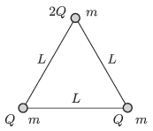

P. 4734. Szigetelő anyagú, vízszintes, sima felületen három darab $m$ tömegű, kisméretű, pozitív töltésű golyót $L$  hosszúságú, elhanyagolható tömegű, szigetelő fonalakkal kötöttünk össze. Két golyó töltése $Q$ , a harmadiké pedig $2Q$ . Egy adott pillanatban a $Q$  töltésű golyókat összekötő fonalat elvágjuk.

 $a)$ Mekkora lesz a golyók sebessége abban a pillanatban, amikor a $2Q$ töltésű golyó sebessége a legnagyobb?
 $b)$ Mekkora erő feszíti a fonalakat ebben a helyzetben?
 $c)$ Mekkora az egyes golyók elmozdulása ebben a pillanatban?

