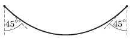

P. 4747. Egy 40 cm hosszúságú lánc két végpontját azonos magasságban rögzítjük az ábrán látható módon. Mekkora a lánc görbületi sugara

 $a)$ a legalsó pontjában,
 $b)$ a felfüggesztési pontokban?

