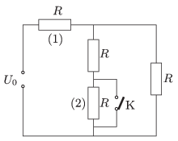

P. 4764. Az ábrán látható elektromos hálózatban minden fogyasztó ugyanakkora $R$ ellenállású. Hány százalékkal változik meg az (1)-es fogyasztó teljesítménye, ha a (2)-es fogyasztót a K kapcsolóval rövidre zárjuk?

 Varga István (1952-2007) feladata

