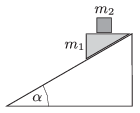

P. 4783. $\alpha=30^\circ$-os hajlásszögű lejtőre helyezett $m_1$ tömegű ék és annak vízszintes lapján lévő $m_2$ tömegű kocka együtt gyorsulva mozog a lejtőn lefelé. Az ék és a lejtő között a súrlódási együttható 0,1.

 Legalább mekkora a súrlódási együttható a kocka és az ék között, ha a kocka nem csúszik meg az éken?

