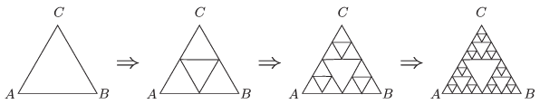

P. 4789. Vékony, egyenletes keresztmetszetű ellenálláshuzalból ún. Sierpinski-háromszöget szeretnénk forrasztani. Ehhez egy szabályos háromszög alakú keretből indulunk ki, melynek $A$ és $B$  csúcsai között $R_0$ ellenállást mérünk. A kerethez első lépésben hozzáforrasztjuk a háromszög középvonalait, majd második lépésben az így keletkezett négy kis háromszög közül a külső három középvonalait is beforrasztjuk. Az eljárást tovább folytatva önhasonló, fraktálszerű drótkeretet kapunk (lásd az  ábrát ).

 Mekkora lesz az $A$ és $B$ pontok közötti ellenállás az $n$ -edik lépés után?

