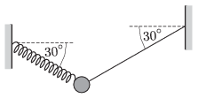

P. 4810. Egy 1 kg tömegű testet egy rugóval és egy fonállal az ábrán látható módon függesztünk fel két fal közé. A rugó és a fonál $30^\circ$-os szöget zár be a vízszintessel.

 $a)$ Mekkora erőt fejt ki a rugó?
 $b)$ Mekkora gyorsulással és milyen irányban indul el a test, ha a fonál elszakad?
 Nagy László fizikaverseny, Kazincbarcika

