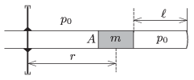

P. 4811. $A=10~{\rm cm}^2$ keresztmetszetű hengerben $m=2~{\rm kg}$ tömegű dugattyú $\ell=
30~{\rm cm}$ hosszú levegőoszlopot zár el. A külső és a belső nyomás egyaránt $p_0=10^5$ Pa. A cső függőleges tengely körül foroghat. Álló helyzetben a dugattyú közepe a tengelytől $r= 0{,}5$ m távolságra van.

 $a)$ Hányszorosára változik a bezárt gáz sűrűsége, ha a csövet $\omega=3~{\rm
s}^{-1}$ szögsebességgel forgatjuk?
 $b)$ Forgás közben mekkorára kellene lecsökkennie a külső nyomásnak ahhoz, hogy a dugattyú az eredeti helyzetébe kerüljön vissza?
 A hőmérséklet mindvégig állandó.
 Szegedi Ervin (1956-2006) feladata

