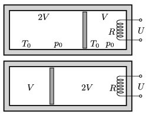

P. 4825. Hőszigetelő tartályt hőszigetelő dugattyú oszt egy $V$ és egy $2V$ térfogatú részre. Kezdetben mindkét részben $T_0=300$ K hőmérsékletű, $p_0=10^5$ Pa nyomású levegő van. A $V=2$ liter térfogatú részbe épített $R=100~\Omega$ ellenállású hődrótos, $U=230$ V-os melegítőt addig működtetjük, amíg a gázok ,,térfogatot cserélnek'', vagyis az  ábra szerinti bal oldali gáz térfogata $V$ -re, a jobb oldali $2V$ -re változik.

 $a)$ Mekkora lett a hőmérséklet a két tartályban?
 $b)$ Mennyi ideig tartott a folyamat?

