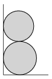

P. 4836. Két egyforma tömegű, homogén tömegeloszlású rudat az ábrán látható módon egy függőleges fal mellett (fekvő helyzetben) óvatosan egymás tetejére helyezünk, majd elengedjük azokat. Mekkora lesz a rudak legnagyobb sebességének aránya, ha a felső rúd sugara csak egy hajszálnyival kisebb az alsóénál? (A súrlódás mindenhol elhanyagolhatóan kicsi.)

 Példatári feladat nyomán

