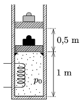

P. 4858. Egy 0,5 m$^2$ alapterületű, hőszigetelt hengerben lévő, a terheléssel együtt 1 tonna tömegű, ugyancsak hőszigetelt dugattyú a henger aljától számított 1 m magasságban található ütközőkre támaszkodik. A dugattyút és a terhet 0,5 méterrel magasabbra akarjuk emelni úgy, hogy a zárt térrészben lévő levegőt egy 1000 W teljesítményű fűtőtesttel melegítjük. Kezdetben a külső és a belső nyomás egyaránt $10^5$ Pa, a hőmérséklet 300 K.

 $a)$ Mennyi ideig kell a teher emeléséhez a fűtőtestet működtetni?
 $b)$ A közölt hő hány százaléka fordítódik a dugattyú emelésére?
 Nagy László fizikaverseny, Kazincbarcika

