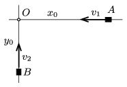

P. 4865. Két, egymásra merőleges, egyenes országúton egyenletes sebességgel halad két gépkocsi az ábra szerint. Kezdetben a járművek $x_0=6$ km és $y_0=3$ km távolságra voltak a kereszteződéstől. Az $AO$ pályán haladó jármű sebessége $v_1=36$ km/h. Mozgásuk során innen 9 perc alatt kerülnek egymáshoz legközelebbi helyzetbe.

 Mekkora a $BO$ egyenesen haladó jármű sebessége, és mekkora a járművek között mérhető legkisebb távolság?

