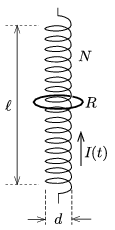

P. 4880. Egy $d=4{,}4$ cm átmérőjű, $\ell=1$ m hosszú, $N=1000$ menetes egyenes tekercs közepén egy $r=2{,}5$ cm sugarú, $R=10^{-4}~\Omega$ ellenállású vastag körvezető gyűrű helyezkedik el koaxiálisan. A tekercsben folyó $50$ A erősségű áramot 1 s alatt $-50$ A erősségűre változtatjuk.

 $a)$ Mekkora a mágneses indukció nagysága a körvezető középpontjában akkor, amikor a tekercs árama éppen nulla?
 $b)$ Mekkora ez az érték ezelőtt, illetve ezután $\Delta t=0{,}001$ s idővel?

