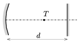

P. 4887. Egy $f$ fókusztávolságú homorú tükör optikai tengelyén, tőle $d$ távolságban, az optikai tengelyre merőlegesen, a homorú tükörrel szemben egy síktükör van. Az optikai tengelyen hová helyezzük a pontszerűnek tekinthető $T$ fényforrást, hogy az abból induló fénysugarak a homorú tükörről, majd a síktükörről visszaverődve ugyanúgy a fényforrás helyén alkossanak képet, mint a síktükörről, majd a homorú tükörről visszaverődő fénysugarak? Milyen feltétel teljesülése esetén lehetséges ez?

