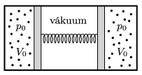

P. 4921. Vízszintes, mindkét végén zárt hengerben lévő, súrlódásmentesen mozgó dugattyúk $p_0=10^4$ Pa nyomású, $V_0=2~\rm dm^3$ térfogatú, azonos hőmérsékletű és anyagi minőségű, kétatomos ideális gázokat zárnak el. A dugattyúkat egy olyan rugó köti össze, melynek nyújtatlan hossza a henger hosszával azonos. A dugattyúk között vákuum van.

 $a)$ Mekkora a rugóban tárolt energia ebben az állapotban?
 $b)$ A gázokat egy adott pillanatban azonos módon, lassan melegíteni kezdjük, és az abszolút hőmérsékletüket a háromszorosára növeljük. Mekkora lesz a gázok nyomása a melegítés után?
 $c)$ Mennyi hőt kellett közölni a rendszerrel, ha a veszteségektől eltekintünk?

