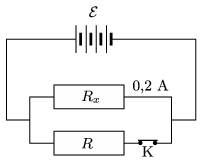

P. 4922. Egy telep elektromotoros ereje $\mathcal{E}= 18$ V. A párhuzamosan kapcsolt egyik, $R_x$ ellenállású fogyasztón 0,2 A erősségű áram folyik, a másik fogyasztó ellenállása $R=8~\Omega$. Ha ezt a fogyasztót a K kapcsoló nyitásával kiiktatjuk, az áram erőssége az $R_x$ ellenálláson 0,3 A-re nő. Mekkora a fogyasztó ellenállása és a telep belső ellenállása?

