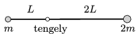

P. 4929. Az ábrán látható, $3L$ hosszúságú, elhanyagolható tömegű, merev rúd a bal oldali végétől $L$ távolságra lévő, rögzített, vízszintes tengely körül függőleges síkban súrlódásmentesen foroghat. A rúd végeihez $m$, illetve $2m$ tömegű, kis méretű testeket erősítünk, majd egy adott pillanatban a rudat vízszintes helyzetből elengedjük.

 $a)$ Határozzuk meg a testek sebességét abban a pillanatban, amikor a rúd éppen függőleges!
 $b)$ Mekkora erővel nyomja ekkor a rúd a tengelyt?
 $c)$ Mekkora a testek gyorsulása a rúd elengedése utáni pillanatban?

